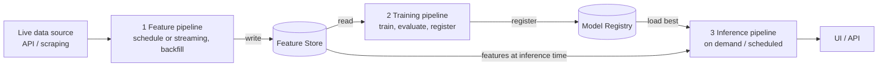

# HSLU MLOps HS26 — Semester Project

Module: **I.BA_MLOPS.H2601 · Machine Learning Operations** · Bachelor Informatik, Hochschule Luzern · Autumn Semester 2026.

Goal: build a **live ML system** — an automated, cloud-deployed pipeline that ingests dynamic data, computes features, trains a model and serves predictions, following the **FTI architecture**.

> Status: project setup. Topic and data source to be fixed for MS1 (proposal due 01.10.2026).

## FTI architecture



| Pipeline | Trigger | Responsibility |
| --- | --- | --- |
| Feature | schedule / streaming | fetch raw live data, compute features, write to feature store, backfill |
| Training | scheduled / manual | read features, train, evaluate, track experiments, register best model |
| Inference | UI request / schedule | load best registered model, serve predictions |

## Project requirements

- **Format:** individual project, public GitHub repo, kept reachable all semester.
- **Data:** dynamic/live sources only (crypto, weather, SBB delays, …) — no static datasets.
- **Stack:** GitHub, Docker, MLflow or W&B, GitHub Actions or Airflow.
- **Deployment:** cloud deployment is mandatory (GCP / AWS / Hugging Face). USD 50 GCP credits available for students.
- **Grading focus:** the pipeline, not model accuracy. A fully automated pipeline at 60% beats a manual notebook at 99%.

## Milestones and deadlines

| Milestone | Due | Weight | Deliverable |
| --- | --- | --- | --- |
| MS1 Proposal | Thu 01.10.2026, 23:59 (ILIAS) | 10% | max. 2-page PDF, also committed as `docs/proposal.pdf` |
| MS1 Reviews | Thu 08.10.2026 | 10% | 2 anonymous peer reviews |
| MS2 Feature Pipeline | Thu 05.11.2026 | 10% | repo state + `docs/ms2_summary.pdf` |
| MS2 Reviews | Thu 12.11.2026 | 10% | 2 peer reviews |
| MS3 Training Pipeline | Thu 03.12.2026 | 5% | repo state + `docs/ms3_summary.pdf` |
| MS3 Reviews | Thu 10.12.2026 | 5% | 2 peer reviews |
| Oral Exam (Q&A) | Thu 17.12.2026 | 30% | ~15 min individual, on this repo, no presentation |
| MS4 Live System | Sun 10.01.2027 | 20% | code freeze, deployed URL, max. 3 min video pitch, `docs/ms4_summary.pdf` |

Milestones are graded at the **last commit before the deadline**. Tag them: `git tag ms2 && git push --tags`.

### Milestone contents

- **MS1 Proposal:** problem statement (what, horizon, success criterion vs. a baseline), originality & motivation, data source & features (update frequency, label, leakage/split), system design (embedded FTI diagram, stack, repo link).
- **MS2 Feature pipeline:** automated ingestion + backfill, feature engineering & storage, scheduled execution (not manual), Docker image, pinned deps, README.
- **MS3 Training pipeline:** reads MS2 features, reproducible training & evaluation without leakage, MLflow/W&B tracking, model registered, auto-retrain trigger.
- **MS4 Live system:** all 3 pipelines + feature store, scheduled automation and cloud deploy, serving UI, observability (tracking, deployed version, drift monitoring), tests/Docker/pinned deps.

Each milestone summary (max. 2 pages) contains what was achieved **and** a numbered response to every reviewer point (A1, B1, E1 …) with status `Changed · Partly · Rejected · Not yet` and the commit/file.

## Repository layout

```
├── README.md            prediction · FTI diagram · clone-and-run steps · live URL · video link (by MS4)
├── docs/                proposal.pdf, ms2_summary.pdf, ms3_summary.pdf, ms4_summary.pdf, architecture.png
├── src/<package>/
│   ├── features/        feature pipeline (ingest, backfill, compute, write)
│   ├── training/        training pipeline (read features, train, evaluate, register)
│   ├── inference/       inference pipeline (load model, predict, serve)
│   └── common/          shared code (config, IO, feature definitions)
├── ui/                  Streamlit / Gradio front end
├── config/              settings without secrets
├── tests/               unit tests, run in CI
├── notebooks/           exploration only
├── .github/workflows/   scheduled pipelines, CI, deploy
├── Dockerfile           (+ docker-compose.yml for multiple services)
├── pyproject.toml + uv.lock
├── .env.example
└── .gitignore
```

Keep feature definitions in one place shared by training and inference to avoid training–serving skew.

## Rules

- No secrets in the repo or its history. Use `.env` (gitignored) and GitHub Secrets; a leaked key must be rotated.
- No data, model artifacts or `mlruns/` in git.
- Pipelines never import from notebooks.
- AI tools are allowed, but every line and decision must be explainable at the oral exam.
- Individual work; inspiration from mlops-lab.ch and KTH ID2223 is fine, copying is not.

## Course material

`ilias-dump/` holds the ILIAS export: project presentation and guidelines (proposal, repository, milestone summary, review) plus the lecture decks (MLOps intro, infrastructure, model registry/MLflow, processing & prediction modes, stream processing, FTI architecture, data drift, feature stores).

Lecturers: Marc Bravin (module head), Florian Bär, Tobias Mérinat, Josiah Rohrer. Thursdays 09:05–11:25, Rotkreuz S1A_209.
