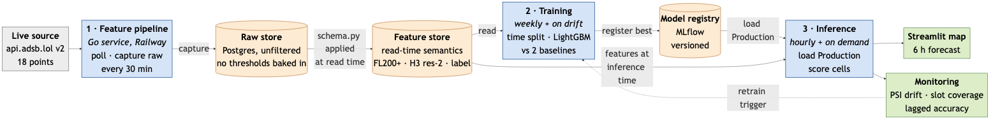

# 1 Problem statement

**What and for whom.** GNSS jamming and spoofing are now routine over the Baltic, the
Black Sea and the Eastern Mediterranean: aircraft lose the integrity of their satellite
position solution mid-flight. Public tools such as gpsjam.org render *yesterday's* map.
A dispatcher planning a route, a drone operator or a flight-ops centre needs the
opposite, a statement about the hours ahead.

**Prediction.** For every H3 resolution-2 airspace cell (\textasciitilde 180 km edge),
predict the probability that the cell will be *interference-affected* **exactly 6 hours
ahead** (a binary classification per cell-hour, produced every hour).

**Scope.** European and adjacent airspace, covered by 18 sampling discs of 250 NM: 11
over regions where interference is reported, 7 over Western-European control regions.
One sweep currently yields ~5 200 stored observations, of which ~2 800 are at cruise
altitude, over ~80 populated cells.

**Label.** A cell-hour is affected when at least **30 %** of the cruise-altitude aircraft
in it broadcast a degraded navigation integrity category (NIC < 7, i.e. a containment
radius worse than 0.2 NM). NIC is each aircraft's own assessment of its position quality,
transmitted over ADS-B. The label is therefore a *fleet-level consensus about a physical
event*, aggregated over independent airframes at a future timestamp, not a rule applied
to the model's inputs.

**Success criterion.** On a strictly out-of-time test split, the model must beat two
baselines:

| Baseline | Why it is the bar |
| :--- | :--- |
| **Persistence**: state at $t$ repeated at $t+6\,\text{h}$ | Interference is strongly autocorrelated; not beating this means nothing was learned |
| **Per-cell hourly climatology** | Encodes "the Gulf of Finland is usually bad at 14:00" with no live signal |

**Target: PR-AUC at least 0.10 above persistence, and a lower Brier score**, with the
gain holding *separately* in the interference regions and the control regions. The
positive class is rare (4.5 % of cells in the validation snapshot, 3/67), so accuracy is
meaningless and PR-AUC is the headline metric. It is handled with class weighting, a
decision threshold tuned on the validation split, and precision/recall reported per
region, because a model that permanently flags the whole Baltic would look good globally
and be operationally useless.

# 2 Originality & motivation

Checked against the HSLU archive (mlops-lab.ch) and the KTH ID2223 project lists: both
are dominated by crypto prices, weather, air quality and transport availability. Nothing
there predicts the *quality* of a navigation signal, and no ADS-B project appears.

**In one sentence: the dataset does not exist until my pipeline creates it, and the label
is inferred from fleet telemetry rather than read from a column.** Concretely:

1. **No historical download exists** for per-cell navigation integrity. The feature
   pipeline is the sole source of history, which makes the scheduled job load-bearing
   rather than decorative.
2. **The label is constructed**, from a fleet-level statistic over self-reported avionics
   quality, with a defensible threshold and an explicit traffic floor.
3. **Drift is the subject, not an afterthought.** A new emitter switching on is genuine
   concept drift in the region it covers, so the MS4 monitoring measures the very
   phenomenon being modelled.

Motivation: GNSS interference is an active civil-aviation safety concern in Europe, the
raw telemetry is fully public, and I want a project whose failure modes are physical
rather than financial.

# 3 Data source & features

**Source.** `api.adsb.lol` v2, a public community ADS-B aggregator, endpoint
`/v2/point/{lat}/{lon}/{radius}`. It is a documented JSON **API, not scraping**, free and
key-less for non-commercial use. **Fallback:** `api.adsb.fi` serves the same schema and is
a one-line configuration change (`SKYJAM_ADSB_BASE_URL`).

**Update frequency and volume.** The feed is real time; the pipeline sweeps all 18 points
every **30 minutes** with paced requests and exponential backoff on HTTP 429. History
**starts when the poller starts**: there is no back-download. At ~80 cell-rows per sweep
the store grows by roughly **1 900 cell-hours per day**, so MS3 in December will have on
the order of 100 000 labelled rows. Capture is a Go service on Railway, not a GitHub cron:
four staggered crons achieved only **53 % hourly capture** over 74 h, because GitHub drops
scheduled triggers under load and never retries, and here every dropped trigger is
permanently lost data. A process with its own ticker does not drop ticks.

**Validated signal** (live snapshot, aircraft at or above FL200, degraded = NIC < 7):

| Interference region | Deg. | Interference region | Deg. | Control region | Deg. |
| :--- | ---: | :--- | ---: | :--- | ---: |
| Gulf of Finland | **52.0 %** | Baltic south | 13.2 % | Germany | 2.4 % |
| Poland east | **34.0 %** | Romania/Moldova | 6.2 % | Switzerland | 1.4 % |
| Kaliningrad | **25.9 %** | Black Sea west | 5.1 % | UK / France | 1.0 / 0.0 % |

A ~40-fold separation between the worst region and the controls, so the target is real
rather than assumed. **The altitude filter is a feature, not a formality:** an unfiltered
probe of the Swiss disc shows **8.9 %** degraded aircraft against **2.3 %** at FL200+,
because cheap general-aviation avionics report poor integrity everywhere; the same filter
leaves the Baltic figures essentially untouched. Regional shares move hour to hour, which
is the phenomenon being forecast, not noise in the measurement.

**Named features**, per cell and hourly slot: `aircraft_count`, `degraded_share`,
`median_nic`, `p25_nic`, `mean_nac_p`; lags of `degraded_share` and of the binary state at
1, 2, 3, 6, 12, 24 and 168 h; backward-looking rolling means of `degraded_share` over 6 h
and 24 h; `aircraft_count_mean_24h`; and the calendar features `hour_utc` and
`day_of_week`.

**Leakage.** (i) *Split*: strictly chronological --- train on the earliest period,
validate on the middle, test on the most recent, with a 6-hour gap between segments so no
example straddles a boundary. No shuffling anywhere. (ii) *Temporal, not positional lags*:
lags are computed after reindexing each cell onto a gap-free hourly grid, because a
positional `shift(1)` would silently present a three-hour-old observation as one hour old
whenever the cron skipped a run; a unit test asserts the lag across a deliberately removed
hour is `NaN`. (iii) *Rolling windows exclude the present*, shifted by one slot before
aggregation, verified by test. (iv) *Unobserved is not quiet*: cells below five aircraft
are dropped rather than imputed as clean, and rows whose future state was never observed
carry no label.

# 4 System design

**Pipelines and triggers.** (1) *Feature*: a Go service on Railway sweeps all 18 points
every 30 minutes and writes **unfiltered** observations to PostgreSQL: raw coordinates, a
nullable altitude, no H3 cell and no label. Thresholds are applied when *reading*, so the
altitude floor or the H3 resolution can still be changed and the whole history rebuilt,
rather than being frozen at capture time. (2) *Training*: weekly and on demand, reads the
store, splits chronologically, trains against both baselines, logs to MLflow and registers
the best run. (3) *Inference*: hourly and on UI request, loads the Production model and
writes a 6-hour forecast per cell.

**Stack**, one line each:

- **Feature store** --- PostgreSQL on Railway: durable (unlike the 90-day CI artifacts it
  replaced), and SQL applies thresholds at read time over ~100 k rows naturally.
- **Orchestration** --- a long-lived Go service with its own ticker, because a missed hour
  is permanently lost and a best-effort scheduler measurably loses half of them.
- **Tracking / registry** --- MLflow: run comparison plus a Production alias for inference
  to load, so the deployed version is always identifiable.
- **Serving** --- Streamlit map on Railway: same platform as the data, and a map is the
  natural view of a spatial forecast.
- **Packaging** --- Docker + `uv.lock` for Python, a 21 MB distroless image for Go.

**Training--serving skew is prevented structurally:** the thresholds, the altitude floor,
the H3 resolution and the lag set live in `src/skyjam/common/schema.py` and are applied on
read, so they cannot be baked into stored data. The capture service computes **no** label:
duplicating that rule into a second language is precisely the skew this guards against.
The sampling coordinates, which *are* shared with Go, have a parity test that fails the
build if the two drift.

**Optional / stretch (not core):** Terraform IaC, Airflow, a managed feature store,
alerting on the drift metric. Core FTI comes first.

**Current state.** The capture service is deployed and green, sweeping 18/18 points per
run; the store holds **117 000 observations across 41 hourly slots**, which the read path
turns into a leakage-safe training table (1 012 rows, 8.7 % positive). 34 Python and 12 Go
tests pass, the SQL ones against a real PostgreSQL rather than a mock.
**Public repository:** <https://github.com/Zayden16/hslu-mlops-hs-26>

**Risks.** History accrues only from now on --- mitigated by ingesting from proposal time
and storing raw unfiltered, so a definition change does not invalidate it. The original
design would have lost its earliest data to the 90-day artifact cap on 16.12.2026, before
MS4 is graded; PostgreSQL removes that deadline, and that history was recovered from those
artifacts before they expired. The API could rate-limit or vanish --- pacing tuned to the
measured limit (12 s), backoff, `adsb.fi` fallback. Sparse night traffic --- a per-cell
traffic floor, unobserved cells excluded not imputed.
